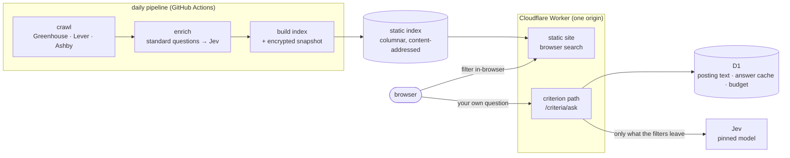
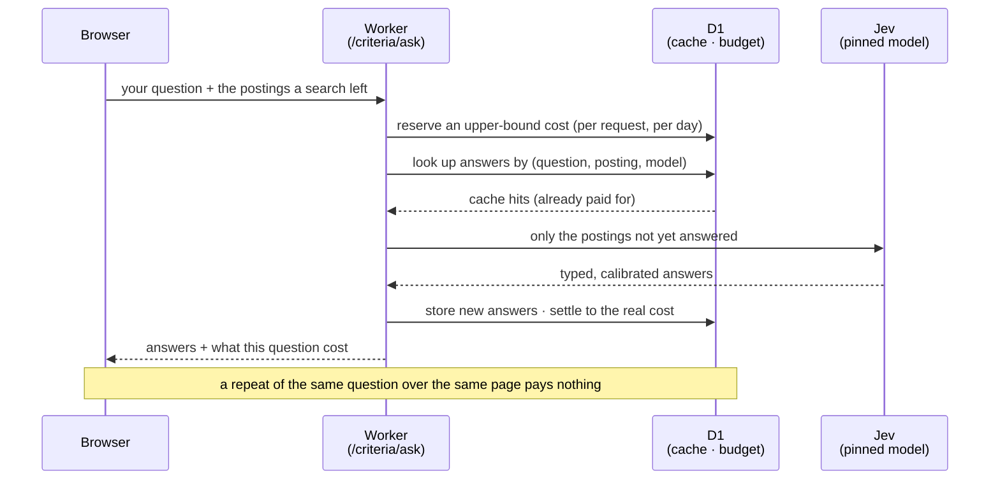

# Quarry

**Ask your own questions of every job posting.**

[](https://github.com/swarina/quarry/actions/workflows/ci.yml)
[](LICENSE)


Job search tools extract a fixed set of fields from each posting, because running a language model
over every posting for every user's question is too slow and too expensive. Quarry takes the other
road. A daily pipeline crawls company job boards and answers a standard set of questions about every
posting with [Jev](https://docs.typesafe.ai/), a model that returns **typed values with calibrated
probabilities instead of generated text**. You search those answers in your browser over a static
index, and then **ask your own question of the postings a search leaves** (yes/no, pick-one, or a
graded scale), answered on demand and bounded by a budget. A wording is the question: an answer is
cached by question text, posting content, and model version, so the second person to ask the same
thing pays nothing.

## What it demonstrates

1. **Calibrated AI, not generated prose.** Jev returns a value and a probability, never a sentence a
   model wrote. The whole distribution is stored, not just the picked option, so "remote or hybrid,
   at least 70%" means something and a posting nothing has been asked about is never shown as a no.
   Jev returns no quotations or spans, so Quarry does not pretend to have them.
2. **Cost-bounded inference on demand.** A novel question is answered only for the page a search
   leaves (about $0.04 for 500 postings), under a per-request and a per-day cap that reserve before
   spending and settle after, so a bug is cheap per request and never ruinous per day.
3. **Search with no server.** The index is a static, content-addressed, columnar file; filtering
   (including by calibrated answers) runs entirely in the browser, and the whole search lives in the
   URL, so a search is shareable and the back button works, with no accounts and nothing logged.
4. **A pipeline that is polite and reproducible.** Boards are crawled one request at a time with
   conditional revalidation; each crawl is stored as an observation and the posting lifecycle is
   derived from it; the store ships as encrypted, drill-tested snapshots.

## Architecture



Search needs no server: it is static files the browser filters. Only the custom-question path spends,
and only it touches D1. The static site and that path are served from one origin so there is no CORS
on an endpoint that spends money. A criterion's answers are cached in D1, so a popular question over a
popular filter is paid for once for everyone.

### A question's lifecycle



## Working with Jev, a calibrated model

[Jev](https://docs.typesafe.ai/) is a System One model: a request is `{ state, questions, model }` and
every answer is a **typed value with a calibrated probability**, never a sentence. There is no free
text, so there is nothing to parse, nothing to jailbreak, and no place for a quotation to hide (Quarry
does not claim evidence spans it cannot get). An answer comes in one of three shapes:

| Answer shape | What Jev returns | Example question | An answer |
| --- | --- | --- | --- |
| **Yes / no** | one probability, P(yes) | *On call outside working hours?* | unlikely, **18%** |
| **Pick one** | a probability over named options | *Remote, hybrid, or onsite?* | hybrid **40%** · remote **35%** · onsite **25%** |
| **Graded scale** | a probability over ordered levels | *How much travel?* | some **50%** · little **30%** · a lot **20%** |

That turns the product from a *prompting* problem into a **calibration** problem, and the whole model
layer follows from it:

| The discipline | Why it exists |
| --- | --- |
| **Store the distribution, not the pick** | A posting that is hybrid 40% / remote 35% is kept by "remote or hybrid ≥ 70%" and dropped by filtering on the single best guess. The threshold only means something with the whole distribution, and every filter is then one shape regardless of answer kind. |
| **Centi-probabilities, not floats** | Jev publishes two decimals, so integers 0–100 (normalized by largest remainder) are lossless and "P(not these) = 100 − theirs" never totals 99. |
| **One guarded door to the model** | A single package pins the version, validates every answer against its schema before anything trusts it, and meters spend and rate. Nothing else may import the SDK (the linter enforces it), so the model is one auditable surface. |
| **Cassettes, not mocks** | Real API exchanges are recorded once and replayed offline, so the whole path is tested deterministically instead of mocked. |
| **The model version is in the cache key** | `key = hash(question · posting · model)`, so editing a word re-asks, a repost is free, and a model upgrade re-asks rather than serving old probabilities as a new model's. |

The honest open question, marked in the code where the bands are defined, is whether the model is
*actually* calibrated on this corpus: 80% is only useful if answers called 80% likely are right about
80% of the time. A harness (Brier score, reliability tables, expected calibration error) exists to
measure exactly that against a hand-labelled set; until it runs, the bands are provisional and no
accuracy figure is claimed.

## What a question costs

Running a model over every posting for every visitor's question is exactly what Quarry refuses to do.
The standard questions are answered once, in the daily pipeline; a *novel* question is answered on
demand, and only over the slice of postings a search actually left. That is what makes an open-ended
"ask anything" feature affordable at all.

Jev charges **$0.042 per million input tokens, and nothing for output**. The only text sent is each
posting's `{title, company, locations, description}` plus your question, so one posting's cost is
essentially its length:

```
tokens ≈ bytes(posting + question) / 4
cost   = tokens × $0.042 / 1,000,000
```

A page of 500 postings, asked once:

| Posting length | ≈ tokens each | Cost per posting | A page of 500 |
| --- | --- | --- | --- |
| short (~1,500 chars) | ~440 | $0.000018 | **~$0.009** |
| typical (~2,500 chars) | ~690 | $0.000029 | **~$0.014** |
| long (~4,000 chars) | ~1,060 | $0.000045 | **~$0.022** |

So a brand-new question over a full page is **a cent or two**, and a narrower search costs
proportionally less. Two design choices then bound it on both sides:

- **The cache makes every repeat free.** Answers are keyed on `hash(question · posting · model)`, so
  once anyone has asked a question over a posting, everyone after them pays nothing for it. Only
  genuinely new (question, posting) pairs ever cost anything, which is why a popular question over a
  popular filter is paid for once for the whole internet.
- **Reserve-then-settle makes the caps exact.** An upper bound is reserved before the call and
  reconciled to the true cost after, so under concurrency the per-request cap (**$0.10**) and the
  per-day cap (**$2.00**, across everyone) hold exactly rather than being overshot by the requests
  already in flight.

The interview-sized version: the expensive step, a model read of a posting, is done once and cached;
the cost is reserved before it is spent, not discovered after; and a visitor only ever pays for the
handful of postings their own filter could not already answer. The worst case a single question can
reach is ten cents, the common case is a cent, and the whole day is capped at two dollars no matter
how many people ask.

## Design principles

*(Hard rules. Violating one is a bug, not a style choice.)*

- **Never guess an external API or its limits.** The model is pinned and every answer is validated
  against its schema before it is trusted; Jev's own option and length limits are enforced before a
  request is built. Cloudflare and Jev limits are read from the docs and dated in an ADR, not
  recalled from memory.
- **A wording is the question.** Answers are keyed on question text, posting content, and model
  version, so editing a word re-asks, a repost is free, and a model upgrade invalidates cleanly.
- **Reserve before spending, settle after.** An exact cap under concurrency needs an upper bound
  reserved before the call and reconciled to the real cost after, for both the per-request and the
  daily budget.
- **Not asked is not no.** A posting with no answer never matches a threshold filter, and an answer
  whose own best guess is weak is shown as "unsure" rather than silently dropped.
- **Politeness by construction.** robots.txt, one request at a time per host with a second between,
  conditional revalidation, and a one-day honored removal list, enforced in the client so a caller
  cannot forget.
- **The secret lives in memory only.** Asking is closed behind a shared secret that the page holds
  in memory and never writes to the URL or to storage; search stays public static files.

## Quickstart

Requires Node.js 24 and pnpm (via corepack).

```sh
pnpm install
pnpm check
```

Crawl a few boards into a local store (no credentials needed; a repeat crawl revalidates with
`304 Not Modified` and costs almost nothing):

```sh
pnpm pipeline crawl --store data/pipeline.sqlite --max-boards 20
pnpm pipeline index --store data/pipeline.sqlite --out data/index
```

Build and serve the search site:

```sh
pnpm --filter @quarry/site build --index data/index
pnpm --filter @quarry/site serve
```

That serves search alone. To also ask your own questions locally, serve the site beside the
criterion path so both share one origin (asking needs a secret and a `TYPESAFE_API_KEY`, and is
capped per request and per day):

```sh
QUARRY_CRITERIA_SECRET=$(openssl rand -base64 24) TYPESAFE_API_KEY=... \
  pnpm pipeline serve-criteria --store data/pipeline.sqlite --site apps/site/dist
```

## Deployment

The site and the criterion path deploy as a single Cloudflare Worker with a D1 database behind the
path, on Cloudflare's **free** plan (Workers Free and D1 Free), so there is no infrastructure cost;
the only cost is the Jev API when someone asks a genuinely new question, and that is capped. The
design and the dated limits that drove it are in
[ADR-0028](docs/adr/0028-the-secret-in-memory-and-one-origin.md) and
[ADR-0029](docs/adr/0029-deploying-on-cloudflare-workers-with-d1.md); the runnable steps are in
[docs/DEPLOYMENT.md](docs/DEPLOYMENT.md).

## Testing & CI

`pnpm check` is what CI runs: a typography check, Biome lint and format, three TypeScript project
builds, and the full Vitest suite with coverage. Architecture rules (which package may import what,
no `node:*` in portable code, no import cycles) are enforced by the linter, not by review. The daily
[pipeline workflow](.github/workflows/pipeline.yml) crawls, snapshots, and rebuilds the index; a
[restore drill](.github/workflows/restore-drill.yml) proves the snapshots are usable backups; a
[probe](.github/workflows/probe.yml) opens an issue if the schedule stops.

## Repository layout

```
apps/
  pipeline/   CLI: crawl, enrich, build the index, export D1 data, report on each run
  site/       the browser search over the static index (no server, no accounts)
  worker/     the Cloudflare Worker: site + criterion path over D1, one origin
packages/
  ats/        Greenhouse, Lever, Ashby board adapters, tested against recorded responses
  crawl/      a polite HTTP client: robots.txt, pacing, retries, conditional requests
  criteria/   asking your own questions: the criterion, its cache key, the budget, the handler
  domain/     pure shared logic: deterministic JSON and hashing, identity, posting text
  facets/     the standard facets derived from stated fields, and reading stored answers
  jev/        the single guarded entry to Jev: pinned model, validated answers, spend limits
  places/     a gazetteer built from GeoNames, and the reader that places a posting
  questions/  the standard questions, their versions, and the accuracy harness
  search-index/ building the static index, and reading and querying it in the browser
  storage/    the pipeline's SQLite store: schema, migrations, crawl observations, snapshots
docs/adr/     architecture decision records: what was decided, what else was on the table, the cost
seeds/        the boards to crawl, and boards removed at their company's request
```

## Limitations (by design, and honestly)

This is a learning-first project with a hard zero-recurring-cost constraint. The engineering is real;
the scope is deliberately bounded.

- **Asking is not public yet.** The custom-question path is closed behind a shared secret, so it is
  not shareable. Opening it needs per-IP quotas, a global cap, and a visible cost estimate first,
  which is a product to design once the cost model has been seen in real use.
- **Per-question accuracy is not measured yet.** The site groups answers into likely / maybe /
  unlikely bands, but the cuts are chosen by eye pending a hand-labelled golden set, and no accuracy
  figure is claimed until that exists.
- **500 postings and 5 criteria per request are judgements, not measurements.** The first real use
  should check whether a page of results is the unit people actually want to ask about.
- **One model, pinned.** Jev is new; the integration is pinned to a single model version, and a
  calibrated answer belongs to the model that produced it, so an upgrade re-asks rather than reusing.

## Data

Place names come from [GeoNames](https://www.geonames.org), licensed under
[CC BY 4.0](https://creativecommons.org/licenses/by/4.0/); see
[`packages/places/data`](packages/places/data/README.md) for what is used and how it was changed.
Postings belong to the companies that published them: Quarry reads only the public board APIs those
companies expose for embedding, links to the employer's own page to apply, and never copies a
description.

## License

[MIT](LICENSE) © 2026 Swarina Jaiswal
